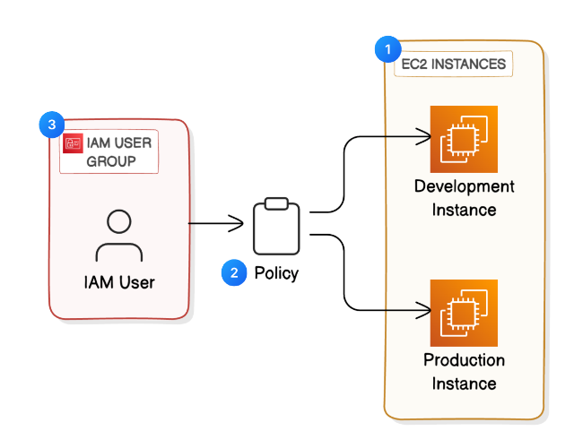
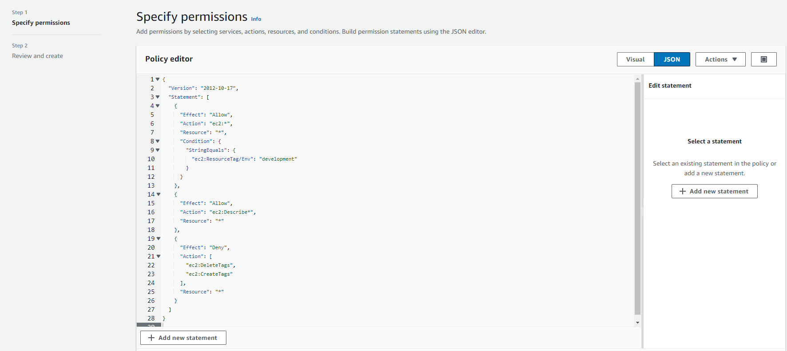

# Cloud-Security-with-IAM-AWS
Managed permissions using IAM. Simulated real project.

## Overview
This project demonstrates how to create IAM user in AWS and to define policy and permissions to user group. As a result, the IAM user is limited to only stop instance in development environment and is not allowed to stop instances in prod environment.

## Architecture

## Screenshot

